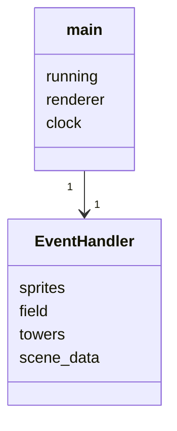

Sovelluksen toiminnasta vastaa tällä hetkellä pääosin luokka `EventHandler`, joka ajaa muita funktioita. `EventHandler`-oliota ajaa `main`-funktio.

```mermaid
classDiagram
  class main {
    running
    renderer
    clock
  }

  class EventHandler {
    sprites
    field
    towers
    scene_data
  }

main "1" --> "1" EventHandler
```
