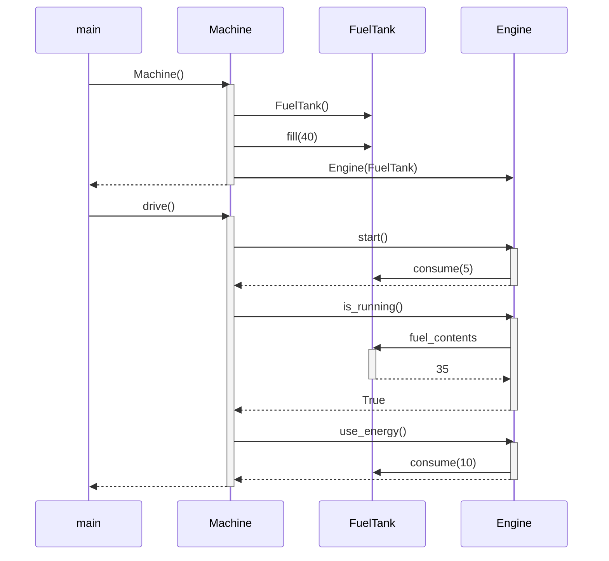

```mermaid
sequenceDiagram
  main ->> Machine: Machine()
  activate Machine
  Machine ->> FuelTank: FuelTank()
  Machine ->> FuelTank: fill(40)
  Machine ->> Engine: Engine(FuelTank)
  Machine -->> main: 
  deactivate Machine
  main ->> Machine: drive()
  activate Machine
  Machine ->> Engine: start()
  activate Engine
  Engine ->> FuelTank: consume(5)
  Engine -->> Machine: 
  deactivate Engine
  Machine ->> Engine: is_running()
  activate Engine
  Engine ->> FuelTank: fuel_contents
  activate FuelTank
  FuelTank -->> Engine: 35
  deactivate FuelTank
  Engine -->> Machine: True
  deactivate Engine
  Machine ->> Engine: use_energy()
  activate Engine
  Engine ->> FuelTank: consume(10)
  Engine -->> Machine: 
  deactivate Engine
  Machine -->> main: 
  deactivate Machine
```
